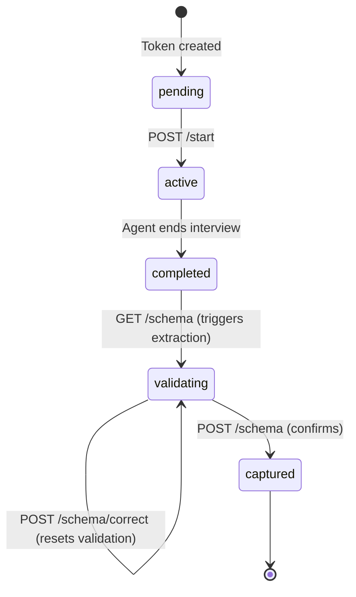

# Front-End API Contract

**Project:** chat2chart (MVP Demo)
**Last Updated:** 2026-04-09
**Audience:** Front-end developers, integration testers

---

## Conventions

Every endpoint follows these rules — no exceptions.

| Convention | Format |
|---|---|
| Success response | `{ data: T }` |
| List response | `{ data: T[], count: number }` |
| Error response | `{ error: { message: string, code: string } }` + HTTP status |
| Dates | ISO 8601 strings (`"2026-04-06T18:30:00Z"`) |
| JSON field casing | camelCase |
| Query param casing | camelCase |

**Auth model:** Two planes, no overlap.

| Plane | Route prefix | Credential |
|---|---|---|
| Interview | `/api/interview/[token]/**` | UUID token in URL — no login |
| Supervisor | `/api/review/**` | Session cookie (email/password login) |

---

## Authentication Endpoints

### `POST /api/auth/login`

Start a supervisor session.

**Auth:** None (public)

**Request:**

```json
{
  "email": "string (valid email)",
  "password": "string (min 1 char)"
}
```

**Responses:**

| Status | Body |
|---|---|
| 200 | `{ data: { role: "pm" \| "supervisor" } }` |
| 400 | `{ error: { message: "Invalid request body", code: "VALIDATION_ERROR" } }` |
| 403 | `{ error: { message: "Access not available. Contact your project manager.", code: "FORBIDDEN" } }` |
| 500 | `{ error: { message: "Internal server error", code: "INTERNAL_ERROR" } }` |

**Side effect:** Sets `session` cookie (HTTP-only, secure in prod, SameSite: lax, 24h max-age).

---

### `GET /api/auth/session`

Check the current session.

**Auth:** Session cookie

**Responses:**

| Status | Body |
|---|---|
| 200 | `{ data: { userId: uuid, email: string, role: "pm" \| "supervisor" } }` |
| 401 | `{ error: { message: "No valid session", code: "UNAUTHORIZED" } }` |

---

### `POST /api/auth/logout`

End the current session.

**Auth:** None

**Response:**

| Status | Body |
|---|---|
| 200 | `{ data: { success: true } }` |

**Side effect:** Clears `session` cookie.

---

## Interview Endpoints

All interview endpoints use the token from the URL path. The token is a UUID v4 that resolves to a specific project, process node, and interviewee slot.

### `GET /api/interview/[token]`

Fetch interview metadata and current state. This is the first call the front-end makes when the interview page loads.

**Auth:** Token in URL

**Response (200):**

```json
{
  "data": {
    "token": "uuid",
    "intervieweeName": "string",
    "intervieweeRole": "string | null",
    "interviewState": "pending | active | completed | validating | captured",
    "project": {
      "id": "uuid",
      "name": "string",
      "skillName": "string"
    },
    "processNode": {
      "id": "uuid",
      "name": "string"
    }
  }
}
```

**Errors:**

| Status | Code | When |
|---|---|---|
| 404 | `INVALID_TOKEN` | Token not found or malformed |
| 500 | `INTERNAL_ERROR` | Server failure |

**UI routing hint:** Use `interviewState` to decide which view to render:

```
pending    → Consent screen
active     → Conversation thread
completed  → Diagram review (triggers extraction)
validating → Diagram review (schema exists)
captured   → Read-only view
```

---

### `POST /api/interview/[token]/start`

Transition from consent screen to active interview. Call this when the interviewee clicks "Begin Interview."

**Auth:** Token in URL
**Request body:** Empty

**Response (201):**

```json
{
  "data": {
    "interviewId": "uuid",
    "status": "active"
  }
}
```

**Errors:**

| Status | Code | When |
|---|---|---|
| 404 | `INVALID_TOKEN` | Token not found |
| 409 | `INTERVIEW_ALREADY_STARTED` | Interview already past `pending` state |
| 500 | `INTERNAL_ERROR` | Server failure |

---

### `POST /api/interview/[token]/messages`

Send a message and stream the agent's response. This is the core interview interaction.

**Auth:** Token in URL
**Content-Type:** `application/json`

**Request:**

```json
{
  "message": "string (trimmed, 1-5000 chars)"
}
```

**Response:** Server-Sent Events stream (`text/event-stream`)

#### SSE Event Sequence

Events arrive in this order for each exchange:

```
1. event: type        → announces what kind of response is coming
2. event: message     → repeated, one per token chunk
3. event: done        → stream complete, exchange persisted
```

#### SSE Event Reference

**`type`** — Emitted first. Tells the UI how to render the upcoming content.

```json
{ "exchangeType": "question" | "reflective_summary" }
```

**`message`** — Streamed token chunks. Concatenate `content` values to build the full response.

```json
{ "content": "string" }
```

**`done`** — Final event. The exchange is now persisted in the database.

```json
{
  "interviewExchangeId": "uuid",
  "segmentId": "uuid",
  "exchangeType": "question" | "reflective_summary"
}
```

**`error`** — Replaces `done` on failure.

```json
{ "message": "The AI agent is temporarily unavailable.", "code": "LLM_ERROR" }
```

#### Non-SSE Errors

These return standard JSON (not SSE) before the stream opens:

| Status | Code | When |
|---|---|---|
| 400 | `VALIDATION_ERROR` | Bad JSON or message fails schema |
| 400 | `INTERVIEW_NOT_ACTIVE` | Interview not in `active` state |
| 404 | `INVALID_TOKEN` | Token not found |
| 500 | `INTERNAL_ERROR` | Server failure |

#### Front-End Consumption Pattern

```typescript
const response = await fetch(`/api/interview/${token}/messages`, {
  method: 'POST',
  headers: { 'Content-Type': 'application/json' },
  body: JSON.stringify({ message }),
});

const reader = response.body!.getReader();
const decoder = new TextDecoder();
let buffer = '';

while (true) {
  const { done, value } = await reader.read();
  if (done) break;

  buffer += decoder.decode(value, { stream: true });

  // Split on double newlines (SSE event boundary)
  const events = buffer.split('\n\n');
  buffer = events.pop()!; // keep incomplete chunk

  for (const raw of events) {
    const eventType = raw.match(/^event: (.+)$/m)?.[1];
    const data = JSON.parse(raw.match(/^data: (.+)$/m)?.[1] ?? '{}');
    // dispatch based on eventType
  }
}
```

#### Segment and Sequence Model

Each interview is divided into **segments**. A segment groups one cycle of:

```
question → response → reflective_summary → confirmation
```

- Messages within a segment share the same `segmentId`
- A new segment starts after a `confirmation` exchange
- `sequenceNumber` is globally unique per interview (monotonically increasing)

---

### `GET /api/interview/[token]/schema`

Fetch the extracted process schema and Mermaid diagram. On first call after interview completion, this triggers extraction automatically.

**Auth:** Token in URL

**Response (200):**

```json
{
  "data": {
    "schema": {
      "schemaVersion": "string",
      "processNodeId": "uuid",
      "interviewId": "uuid",
      "steps": [
        {
          "id": "uuid",
          "label": "string",
          "type": "step | decision",
          "sourceType": "interview_discovered | synthesis_inferred",
          "sourceExchangeIds": ["string"]
        }
      ],
      "connections": [
        {
          "from": "uuid",
          "to": "uuid",
          "label": "string (optional)"
        }
      ],
      "metadata": {
        "extractionMethod": "programmatic | llm_fallback",
        "extractedAt": "ISO 8601",
        "stepCount": "number",
        "decisionPointCount": "number"
      }
    },
    "mermaidDefinition": "string (flowchart TD syntax)",
    "textAlternative": "string (accessibility)",
    "validationStatus": "pending | validated"
  }
}
```

**Errors:**

| Status | Code | When |
|---|---|---|
| 404 | `SCHEMA_NOT_AVAILABLE` | Interview not in a state that allows extraction |
| 404 | `INVALID_TOKEN` | Token not found |
| 500 | `INTERNAL_ERROR` | Extraction failed |

**State transition:** If the interview is `completed`, this call extracts the schema and transitions the state to `validating`.

---

### `POST /api/interview/[token]/schema`

Confirm the schema — the interviewee agrees the diagram represents their process.

**Auth:** Token in URL
**Request body:** Empty

**Response (200):**

```json
{
  "data": {
    "interviewState": "captured",
    "validationStatus": "validated"
  }
}
```

**Errors:**

| Status | Code | When |
|---|---|---|
| 400 | `INVALID_STATE` | Interview not in `validating` state |
| 404 | `SCHEMA_NOT_AVAILABLE` | No schema found |
| 404 | `INVALID_TOKEN` | Token not found |

**State transition:** `validating` -> `captured`. This is a terminal state.

---

### `POST /api/interview/[token]/schema/correct`

Submit a correction and stream the AI-revised schema. Used when the interviewee spots an error in their diagram.

**Auth:** Token in URL
**Content-Type:** `application/json`

**Request:**

```json
{
  "errorDescription": "string (1-1000 chars)",
  "currentSchema": { }
}
```

`currentSchema` is passed through to the correction agent as context — send the full schema object from the last `GET /schema` response.

**Response:** Server-Sent Events stream (`text/event-stream`)

#### SSE Event Sequence

```
1. event: message  → streamed explanation/reasoning (repeated)
2. event: schema   → corrected schema + new Mermaid definition
3. event: done     → stream complete
```

#### SSE Event Reference

**`message`** — Streamed reasoning about the correction.

```json
{ "content": "string", "exchangeType": "correction" }
```

**`schema`** — The corrected result. Replace the current schema and re-render the diagram.

```json
{
  "schema": { /* full IndividualProcessSchema */ },
  "mermaidDefinition": "string"
}
```

**`done`** — Correction complete.

```json
{}
```

**`error`** — Correction failed.

```json
{ "message": "The AI agent is temporarily unavailable. Please try again.", "code": "LLM_ERROR" }
```

#### Non-SSE Errors

| Status | Code | When |
|---|---|---|
| 400 | `VALIDATION_ERROR` | Bad JSON or body fails schema |
| 400 | `INVALID_STATE` | Interview not in `validating` state |
| 404 | `INVALID_TOKEN` | Token not found |

**State effect:** Resets `validationStatus` to `pending` — the interviewee must confirm again after correction.

---

## Interview State Machine



| State | UI View | Available Actions |
|---|---|---|
| `pending` | Consent screen | Start interview |
| `active` | Conversation thread | Send messages |
| `completed` | Loading/transition | Fetch schema |
| `validating` | Diagram review | Confirm or correct |
| `captured` | Read-only view | None |

---

## Error Code Reference

| Code | HTTP Status | Description |
|---|---|---|
| `VALIDATION_ERROR` | 400 | Request body failed Zod schema validation or malformed JSON |
| `INTERVIEW_NOT_ACTIVE` | 400 | Tried to send a message but interview is not `active` |
| `INVALID_STATE` | 400 | Interview is in the wrong state for the requested operation |
| `UNAUTHORIZED` | 401 | Missing or expired session cookie |
| `FORBIDDEN` | 403 | Email not on supervisor allowlist or wrong password |
| `INVALID_TOKEN` | 404 | Interview token is malformed or does not exist |
| `SCHEMA_NOT_AVAILABLE` | 404 | No schema exists and interview is not in an extractable state |
| `INTERVIEW_ALREADY_STARTED` | 409 | Attempted to start an interview that is already past `pending` |
| `INTERNAL_ERROR` | 500 | Unexpected server failure |
| `LLM_ERROR` | SSE event | LLM provider temporarily unavailable (streamed, not HTTP status) |

---

## Zod Schemas (Request Validation)

These schemas are enforced server-side. The front-end should validate locally before sending to avoid round-trip errors.

**Source:** [api-requests.ts](../src/lib/schema/api-requests.ts)

### loginSchema

```typescript
{
  email: z.email(),
  password: z.string().min(1)
}
```

### sendMessageSchema

```typescript
{
  message: z.string().trim().min(1).max(5000)
}
```

### correctionRequestSchema

```typescript
{
  errorDescription: z.string().min(1).max(1000),
  currentSchema: z.object({}).passthrough()
}
```

---

## Process Schema Shape (Response Data)

The `schema` field returned by the schema endpoints follows this structure. This is also what gets passed to Mermaid for rendering.

**Source:** [workflow.ts](../src/lib/schema/workflow.ts)

### IndividualProcessSchema

```typescript
{
  schemaVersion: string,
  processNodeId: uuid,
  interviewId: uuid,
  steps: IndividualStep[],       // min 1
  connections: IndividualConnection[],
  metadata: {
    extractionMethod: "programmatic" | "llm_fallback",
    extractedAt: string,         // ISO 8601
    stepCount: number,           // min 1
    decisionPointCount: number   // min 0
  }
}
```

### IndividualStep

```typescript
{
  id: uuid,
  label: string,                 // min 1 char, verb phrase
  type: "step" | "decision",
  sourceType: "interview_discovered" | "synthesis_inferred",
  sourceExchangeIds: string[]
}
```

### IndividualConnection

```typescript
{
  from: uuid,                    // step id
  to: uuid,                     // step id
  label?: string                 // e.g., "Yes" / "No" for decisions
}
```

---

## Session Cookie Details

| Property | Value |
|---|---|
| Name | `session` |
| Content | JWT (HS256) |
| Max-Age | 24 hours |
| HttpOnly | `true` |
| Secure | `true` in production, `false` in development |
| SameSite | `lax` |
| Path | `/` |

**JWT payload:**

```typescript
{
  userId: string,    // uuid
  email: string,
  role: "pm" | "supervisor",
  iat: number,       // issued-at (Unix timestamp)
  exp: number        // expiration (Unix timestamp)
}
```

The front-end never reads the JWT directly — use `GET /api/auth/session` to check session state.

---

## Security Constraints for Front-End

1. **No interview data in `localStorage` or `sessionStorage`** (NFR9)
2. **No API keys in client code** — all LLM calls are server-side
3. **Interview tokens are credentials** — treat them like passwords (don't log, don't persist beyond the URL)
4. **Session cookie is HttpOnly** — JavaScript cannot read it; the browser sends it automatically
