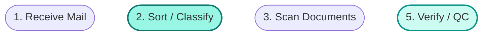

# Story 5.3: Synthesis Comparison View (Mode 2) with Divergence Navigation

Status: ready-for-dev

## Story

As a supervisor,
I want to compare the synthesized workflow against individual diagrams side-by-side and click divergences to navigate,
So that I can discover where processes differ.

## Acceptance Criteria

1. **Given** I am in Mode 1 **When** I click "Compare with Synthesis" **Then** the view transitions to Mode 2: split-screen with synthesis pinned left (~55%) and individual carousel right (~45%) (MVP7, UX-DR10)
2. **Given** the Mode 1 to Mode 2 transition **When** it animates **Then** the synthesis panel slides in from the left with a 200-300ms CSS transition (UX-DR10)
3. **Given** Mode 2 is active **When** the synthesis panel renders **Then** the synthesis diagram renders in a DiagramCanvas (full panel width) with divergence annotation badges on nodes (UX-DR7, UX-DR9)
4. **Given** divergence annotations exist **When** badges render **Then** they are teal pills with three types: "Genuinely Unique" (teal), "Sequence Conflict" (darker teal), "Uncertain — Needs Review" (amber) (UX-DR9)
5. **Given** I click a divergence badge **When** the click registers **Then** the carousel auto-navigates to the relevant interviewee and highlights the corresponding step with a teal glow (`box-shadow: 0 0 0 3px rgba(13,148,136,0.25)`) (MVP8, UX-DR9)
6. **Given** I click a divergence badge **When** the carousel navigates **Then** a divergence detail card appears with 3px teal left border, explanation text, source tags, and confidence level (UX-DR9)
7. **Given** I am in Mode 2 **When** I click "Back to Individual Review" **Then** I toggle back to Mode 1 (MVP9, UX-DR10)
8. **Given** the viewport is below 1200px **When** the page renders **Then** Mode 2 is not available — only Mode 1 is shown, and the "Compare with Synthesis" button is hidden or disabled (UX-DR17)
9. **Given** I focus a divergence badge via keyboard **When** I press Enter **Then** auto-navigation triggers the same as a click (UX-DR16)

## Tasks / Subtasks

- [ ] Task 1: Create `src/components/supervisor/comparison-view.tsx` — the split-screen layout container (AC: #1, #2, #7, #8)
  - [ ] 1.1 Create a `"use client"` component `ComparisonView` that manages the Mode 1 / Mode 2 toggle state via `useState`
  - [ ] 1.2 Accept props: `synthesisData` (synthesis result with `workflowJson`, `mermaidDefinition`, divergence annotations), `individualSchemas` (array of individual schemas with interviewee name/role, `schemaJson`, `mermaidDefinition`), `processNodeName` (string)
  - [ ] 1.3 Implement viewport width detection via `useEffect` + `window.matchMedia('(min-width: 1200px)')` — track in state as `isWideViewport`
  - [ ] 1.4 When `isWideViewport` is false: hide the "Compare with Synthesis" button, force Mode 1, and if currently in Mode 2, auto-revert to Mode 1
  - [ ] 1.5 Implement Mode 2 layout as a CSS grid or flex container: left panel ~55% width for synthesis, right panel ~45% width for the carousel
  - [ ] 1.6 Apply CSS transition for the Mode 1 to Mode 2 switch — synthesis panel slides in from left using `transform: translateX(-100%)` to `translateX(0)` with `transition: transform 250ms ease-out` (200-300ms range)
  - [ ] 1.7 Render the "Compare with Synthesis" button (primary style, blue) below the carousel in Mode 1. Render the "Back to Individual Review" button (secondary style, outlined) in Mode 2
  - [ ] 1.8 Manage local state for: `mode` (`'individual' | 'comparison'`), `selectedDivergenceId` (string | null), `carouselIndex` (number), `highlightedStepId` (string | null)
  - [ ] 1.9 Pass a callback `onDivergenceClick` down to the synthesis panel that updates `carouselIndex`, `selectedDivergenceId`, and `highlightedStepId` based on the divergence data

- [ ] Task 2: Create `src/components/supervisor/divergence-annotation.tsx` — badges and detail cards (AC: #3, #4, #5, #6, #9)
  - [ ] 2.1 Create a `"use client"` component `DivergenceBadge` that renders a teal pill badge on a synthesis diagram node
  - [ ] 2.2 Accept props: `divergence` (object with `id`, `type`, `label`, `description`, `affectedIntervieweeIds`, `affectedIntervieweeNames`, `confidence`, `relatedStepId`, `relatedIntervieweeIndex`), `onClick` callback, `isSelected` boolean
  - [ ] 2.3 Render badge with three color variants based on `type`:
    - `"genuinely_unique"` — teal background (`bg-teal-600 text-white`), label "Genuinely Unique"
    - `"sequence_conflict"` — darker teal background (`bg-teal-700 text-white`), label "Sequence Conflict"
    - `"uncertain"` — amber background (`bg-amber-500 text-white`), label "Uncertain — Needs Review"
  - [ ] 2.4 Badge is a `<button>` element with `role="button"` and `tabIndex={0}` — clickable and keyboard-focusable
  - [ ] 2.5 On click or Enter keypress, call `onClick` with the divergence data (AC: #5, #9)
  - [ ] 2.6 Badge specs: pill shape (`rounded-full`), 10px font weight 600, padding for pill appearance

- [ ] Task 3: Create `DivergenceDetailCard` sub-component (AC: #6)
  - [ ] 3.1 Create a component that renders the divergence detail card when a badge is selected
  - [ ] 3.2 Accept props: `divergence` (same type as badge), `onClose` callback (optional)
  - [ ] 3.3 Render card with: 3px teal left border (`border-l-[3px] border-teal-600`), card background, `shadow-sm`, `rounded-lg`
  - [ ] 3.4 Card content layout:
    - Top row: divergence type badge (small version) + confidence level on the right (e.g., "Confidence: N/A" or "Confidence: High")
    - Step name (bold, e.g., "Step 5: Verify / QC")
    - Explanation text (the narrative description from the synthesis)
    - Source tags: muted background pills showing interviewee names involved and "Not mentioned" tags for those who did not include the step
  - [ ] 3.5 Source tags use muted background, 6px radius, 12px font, muted-foreground color

- [ ] Task 4: Integrate synthesis diagram rendering with divergence overlays in the synthesis panel (AC: #3, #4)
  - [ ] 4.1 In the synthesis panel (left side of comparison view), render a `DiagramCanvas` component from `src/components/diagram/diagram-canvas.tsx` (shared component from Story 3.6) with the synthesis `mermaidDefinition`
  - [ ] 4.2 After Mermaid renders, parse the divergence metadata from the synthesis `workflowJson` (not from Mermaid comments) to determine which nodes have divergence annotations
  - [ ] 4.3 Render `DivergenceBadge` components as absolutely positioned overlays on top of the corresponding Mermaid diagram nodes — position badges using the rendered SVG node coordinates
  - [ ] 4.4 Use `useEffect` to re-calculate badge positions when the diagram re-renders or the panel resizes
  - [ ] 4.5 DiagramCanvas must support a `variant="synthesis"` prop (or similar) that renders at full panel width (no max-width 700px constraint) and enables divergence badge overlay positioning

- [ ] Task 5: Implement divergence click-to-navigate behavior (AC: #5, #6)
  - [ ] 5.1 When a divergence badge is clicked, determine the `relatedIntervieweeIndex` from the divergence data — this is the carousel index to navigate to
  - [ ] 5.2 Update `carouselIndex` in the parent `ComparisonView` state to auto-navigate the carousel
  - [ ] 5.3 Update `highlightedStepId` in the parent state — pass this down to the carousel's `DiagramCanvas` so the corresponding node in the individual diagram gets a teal glow highlight
  - [ ] 5.4 Apply the teal glow highlight on the individual diagram's matching node: `box-shadow: 0 0 0 3px rgba(13,148,136,0.25)` — target the SVG node element via a CSS class or inline style
  - [ ] 5.5 Show the `DivergenceDetailCard` below or beside the synthesis diagram when a divergence is selected
  - [ ] 5.6 Clear the highlight and detail card when a different divergence is selected or when the user navigates the carousel manually

- [ ] Task 6: Adapt `IndividualDiagramCarousel` for Mode 2 compact rendering (AC: #1)
  - [ ] 6.1 The `IndividualDiagramCarousel` component (created in Story 5.2) must accept a `mode` prop: `'full'` (Mode 1) or `'compact'` (Mode 2)
  - [ ] 6.2 In compact mode: arrows shrink to 28px, label font 14px, sublabel font 12px, no "Compare with Synthesis" button, DiagramCanvas fills the panel width
  - [ ] 6.3 In compact mode: accept `highlightedStepId` prop and apply teal glow to the matching node in the rendered Mermaid SVG
  - [ ] 6.4 In compact mode: accept `carouselIndex` as a controlled prop (parent-driven navigation for divergence clicks) while still allowing manual left/right navigation
  - [ ] 6.5 Header compact layout: `< Janet Park (3/3) >` with `Ogden, UT` and step count as sublabel

- [ ] Task 7: Wire up `src/app/review/page.tsx` to fetch data and render the comparison view (AC: #1-#9)
  - [ ] 7.1 Make `src/app/review/page.tsx` a Server Component that fetches synthesis data and individual schemas via `GET /api/synthesis/[nodeId]` (the seeded leaf node ID)
  - [ ] 7.2 The page must check for an authenticated supervisor session — redirect to `/auth/login` if unauthenticated
  - [ ] 7.3 Pass fetched data down to the `ComparisonView` client component
  - [ ] 7.4 Create `src/app/review/loading.tsx` skeleton: layout matches the final page structure with grey placeholder shapes for the carousel area
  - [ ] 7.5 Handle error states: if synthesis data not found, show a centered message "No synthesis results available yet"
  - [ ] 7.6 Include the supervisor top bar (brand icon + app name + project name on left, user name on right) — can be a simple `<header>` element or a separate small component

- [ ] Task 8: Create tests (AC: #1-#9)
  - [ ] 8.1 Create `src/components/supervisor/comparison-view.test.tsx`:
    - Test Mode 1 renders full-width carousel with "Compare with Synthesis" button
    - Test clicking "Compare with Synthesis" transitions to Mode 2 split-screen
    - Test clicking "Back to Individual Review" returns to Mode 1
    - Test "Compare with Synthesis" button is hidden when viewport < 1200px
    - Test auto-revert from Mode 2 to Mode 1 when viewport shrinks below 1200px
  - [ ] 8.2 Create `src/components/supervisor/divergence-annotation.test.tsx`:
    - Test `DivergenceBadge` renders correct label and color for each type (genuinely_unique, sequence_conflict, uncertain)
    - Test badge click calls `onClick` with divergence data
    - Test Enter keypress on badge triggers `onClick`
    - Test `DivergenceDetailCard` renders explanation text, source tags, and confidence level
    - Test detail card has 3px teal left border
  - [ ] 8.3 Create `src/components/supervisor/individual-diagram-carousel.test.tsx` (extend from Story 5.2 tests):
    - Test compact mode renders smaller arrows and fonts
    - Test `highlightedStepId` prop applies teal glow to the correct node
    - Test controlled `carouselIndex` prop navigates to the correct slide
  - [ ] 8.4 Mock `DiagramCanvas` in tests since Mermaid.js requires a DOM — render tests focus on the surrounding logic, not Mermaid rendering

## Dev Notes

### What Already Exists (from Prior Stories)

- `src/app/review/page.tsx` — Placeholder page (`<p>Supervisor Review — placeholder</p>`), will be replaced by this story
- `src/components/supervisor/.gitkeep` — Directory exists, no components yet
- `src/components/diagram/.gitkeep` — Directory exists; `DiagramCanvas` component will be created by Story 3.6 (shared pan/zoom Mermaid wrapper)
- `src/components/shared/.gitkeep` — Directory exists, empty
- `src/hooks/.gitkeep` — Directory exists; `use-mermaid.ts` hook may be created by Story 3.6
- `src/app/api/synthesis/[nodeId]/.gitkeep` — API route directory exists; `GET` handler will be created by Story 4.3
- `src/lib/db/queries.ts` — Exists with query functions; Story 4.3 adds `getIndividualSchemasByNodeId` and `getSynthesisResultByNodeIdWithVersion`
- `src/lib/db/schema.ts` — Complete with all 12 tables including `synthesisResults` (columns: `id`, `projectId`, `processNodeId`, `synthesisVersion`, `workflowJson`, `mermaidDefinition`, `interviewCount`, `createdAt`, `updatedAt`) and `individualProcessSchemas` (columns: `id`, `interviewId`, `processNodeId`, `schemaJson`, `mermaidDefinition`, `validationStatus`, `extractionMethod`, `createdAt`, `updatedAt`)
- `src/lib/auth/middleware.ts` — `withSupervisorAuth` middleware wrapper (Story 5.1)
- `IndividualDiagramCarousel` — Created by Story 5.2 in `src/components/supervisor/individual-diagram-carousel.tsx` (Mode 1 full-width variant)

### Dependencies — Must Be Complete Before This Story

- **Story 3.6** — Creates `DiagramCanvas` (`src/components/diagram/diagram-canvas.tsx`) and `use-mermaid.ts` hook. DiagramCanvas is the shared pan/zoom Mermaid.js wrapper used by both interview and supervisor views.
- **Story 4.3** — Creates `GET /api/synthesis/[nodeId]` route and `src/lib/synthesis/mermaid-generator.ts`. The API returns synthesis results including `workflowJson` (with divergence annotations), `mermaidDefinition`, and individual schemas with their own Mermaid definitions. The Mermaid generator encodes divergence CSS classes on nodes: `divergence-unique`, `divergence-sequence`, `divergence-uncertain`.
- **Story 5.1** — Creates supervisor auth (login page, `withSupervisorAuth` middleware, session management).
- **Story 5.2** — Creates `IndividualDiagramCarousel` (Mode 1 full-width). This story extends it with Mode 2 compact rendering and controlled navigation.

### Synthesis Data Shape

The `GET /api/synthesis/[nodeId]` response (from Story 4.3) returns:

```typescript
{
  data: {
    synthesis: {
      id: string,
      processNodeId: string,
      synthesisVersion: number,
      workflowJson: SynthesisWorkflowJson,  // Contains steps, connections, divergenceAnnotations
      mermaidDefinition: string,             // Mermaid flowchart with divergence CSS classes
      interviewCount: number,
      createdAt: string,
    },
    individualSchemas: Array<{
      id: string,
      interviewId: string,
      intervieweeName: string,
      intervieweeRole: string | null,
      schemaJson: IndividualProcessSchema,
      mermaidDefinition: string,
      validationStatus: string,
    }>,
  }
}
```

### Divergence Annotation Data Structure

Divergence annotations live inside `workflowJson.divergenceAnnotations` (from synthesis engine, Stories 4.1-4.2). Each annotation contains:

- `id` — UUID of the divergence
- `type` — `"genuinely_unique"` | `"sequence_conflict"` | `"uncertain"`
- `stepId` — ID of the synthesis step this divergence is attached to
- `description` — Natural language explanation (from the narrator stage)
- `affectedIntervieweeIds` — Array of interview IDs involved
- `confidence` — Confidence level string or null
- `relatedIndividualStepIds` — Map of interviewId to their individual step IDs for cross-referencing

### Mermaid Diagram Divergence Encoding

Story 4.3 generates Mermaid definitions with CSS classes on divergent nodes:



The rendering layer (this story) adds clickable badge overlays on top of nodes that have these CSS classes. Divergence metadata for the badges comes from `workflowJson.divergenceAnnotations`, not from parsing Mermaid comments.

### DiagramCanvas Integration

`DiagramCanvas` (Story 3.6) is a shared component that:
- Dynamically imports Mermaid.js (no SSR)
- Provides pan/zoom controls (arrow keys for pan, +/- for zoom, "Fit" to reset)
- Renders in a container with configurable max-width
- Exposes the rendered SVG container for overlay positioning

For this story, DiagramCanvas must be used in two contexts:
1. **Synthesis panel (left):** Full panel width, divergence badge overlays positioned on rendered nodes
2. **Individual carousel (right, compact):** Full panel width, highlighted step node with teal glow

The badge overlay positioning strategy: after Mermaid renders the SVG, query the SVG DOM for node elements matching divergent step IDs, get their bounding rectangles relative to the DiagramCanvas container, and absolutely position `DivergenceBadge` components at those coordinates.

### Viewport Width Handling

- Use `window.matchMedia('(min-width: 1200px)')` with an event listener for changes
- When viewport drops below 1200px while in Mode 2: auto-revert to Mode 1, clear any selected divergence
- The "Compare with Synthesis" button should not render at all below 1200px (hidden, not just disabled)
- This is a client-side concern — the page loads as a Server Component, the viewport check happens in the `ComparisonView` client component

### CSS Transition Details

Mode 1 to Mode 2 transition:
- Synthesis panel starts off-screen left (`transform: translateX(-100%)`) and slides to position (`transform: translateX(0)`)
- Carousel compresses from full-width to ~45%
- Duration: 250ms (within 200-300ms range specified by UX-DR10)
- Easing: `ease-out` for natural deceleration
- Use CSS `transition` property, not JavaScript animation libraries

Mode 2 to Mode 1 transition:
- Reverse: synthesis panel slides out left, carousel expands to full-width
- Same duration and easing

### State Management

All state is local to `ComparisonView` — no global state, no context providers:

```typescript
const [mode, setMode] = useState<'individual' | 'comparison'>('individual');
const [carouselIndex, setCarouselIndex] = useState(0);
const [selectedDivergenceId, setSelectedDivergenceId] = useState<string | null>(null);
const [highlightedStepId, setHighlightedStepId] = useState<string | null>(null);
const [isWideViewport, setIsWideViewport] = useState(false);
```

### Keyboard Navigation

- Left/right arrow keys: navigate carousel (inherited from Story 5.2)
- Enter on a focused divergence badge: triggers auto-navigation (same as click)
- Tab: moves focus between divergence badges in the synthesis panel
- Escape: could clear the selected divergence (nice-to-have, not in AC)

### Accessibility

- Divergence badges: `role="button"`, `tabIndex={0}`, `aria-label` describing the divergence type and step
- Carousel auto-navigation: `aria-live="polite"` on the carousel header so screen readers announce the new interviewee
- Detail card: `aria-live="polite"` so screen readers announce the divergence explanation
- DiagramCanvas: `<details><summary>Text description</summary>` for text alternative

### What NOT to Do

- Do NOT implement supervisor editing, approval, or state transitions (MVP10 — viewing only)
- Do NOT add a sidebar, tabs, metrics panels, or dashboard elements — the supervisor experience is immersive comparison only
- Do NOT use a global state library (Redux, Zustand, Context at root) — local state in ComparisonView only
- Do NOT use red/warning colors for divergence annotations — teal and amber only, never red
- Do NOT add toast notifications — all feedback is inline
- Do NOT add filtering or sorting for the carousel — with 3 interviewees, the carousel IS the navigation
- Do NOT implement BPMN export — not in MVP scope
- Do NOT server-side render Mermaid.js — dynamic import only, no SSR
- Do NOT create a review agent or conversational AI editing — not in MVP scope
- Do NOT store any interview or synthesis data in browser localStorage/sessionStorage (NFR9)
- Do NOT import Drizzle outside `src/lib/db/` — the review page calls the API route, not the DB directly

### Project Structure Notes

Files **created** by this story:
- `src/components/supervisor/comparison-view.tsx` — Split-screen layout with mode toggle
- `src/components/supervisor/divergence-annotation.tsx` — DivergenceBadge + DivergenceDetailCard components
- `src/app/review/loading.tsx` — Skeleton loading state for the review page
- `src/components/supervisor/comparison-view.test.tsx` — Tests for comparison view
- `src/components/supervisor/divergence-annotation.test.tsx` — Tests for badge and detail card

Files **modified** by this story:
- `src/app/review/page.tsx` — Replace placeholder with Server Component that fetches data and renders ComparisonView
- `src/components/supervisor/individual-diagram-carousel.tsx` — Add compact mode, controlled carouselIndex, highlightedStepId props (extend from Story 5.2)
- `src/components/supervisor/individual-diagram-carousel.test.tsx` — Add tests for compact mode and highlight behavior

Files **NOT modified** by this story:
- `src/lib/db/schema.ts` — already complete
- `src/lib/db/queries.ts` — query functions added by Story 4.3
- `src/lib/synthesis/mermaid-generator.ts` — created by Story 4.3
- `src/components/diagram/diagram-canvas.tsx` — shared component from Story 3.6 (may need minor interface extension for overlay positioning, but core changes belong to 3.6)

### References

- [Source: _bmad-output/planning-artifacts/epics.md#Story 5.3 — Acceptance criteria, FRs]
- [Source: _bmad-output/planning-artifacts/prd.md#MVP7 — Mode 2 split-screen]
- [Source: _bmad-output/planning-artifacts/prd.md#MVP8 — Clickable divergence annotations]
- [Source: _bmad-output/planning-artifacts/prd.md#MVP9 — Toggle between Mode 1 and Mode 2]
- [Source: _bmad-output/planning-artifacts/prd.md#MVP-NFR3 — Instant carousel navigation]
- [Source: _bmad-output/planning-artifacts/ux-design-specification.md#DivergenceAnnotation — Badge types, colors, click behavior, detail card anatomy]
- [Source: _bmad-output/planning-artifacts/ux-design-specification.md#IndividualDiagramCarousel — Mode 1 and Mode 2 anatomy, specs]
- [Source: _bmad-output/planning-artifacts/ux-design-specification.md#Loading & Transition Patterns — Mode toggle 200-300ms CSS transition]
- [Source: _bmad-output/planning-artifacts/ux-design-specification.md#Responsive Design — 1200px+ for Mode 2]
- [Source: _bmad-output/planning-artifacts/ux-design-specification.md#Keyboard Navigation — Supervisor comparison tab order]
- [Source: _bmad-output/planning-artifacts/architecture.md#Supervisor Experience Components — comparison-view, divergence-annotation, individual-diagram-carousel]
- [Source: _bmad-output/planning-artifacts/architecture.md#File Structure — src/components/supervisor/]
- [Source: _bmad-output/implementation-artifacts/4-3-synthesis-mermaid-generation-and-retrieval-api.md — API response shape, Mermaid divergence encoding]
- [Source: _bmad-output/coding-standards.md#Section 11 — Component organization rules]
- [Source: _bmad-output/project-context.md#Framework-Specific Rules — Server Components default, use client at leaf]

## Dev Agent Record

### Agent Model Used

### Debug Log References

### Completion Notes List

### Change Log

### File List
