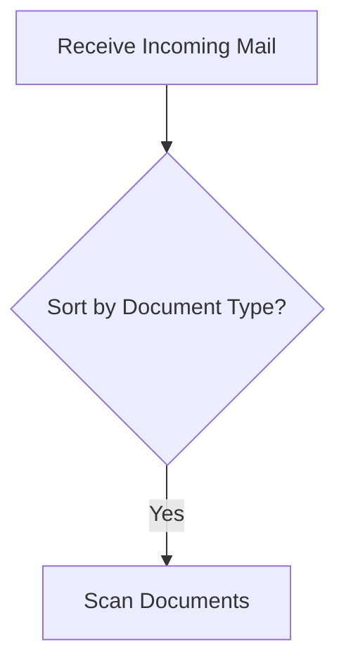
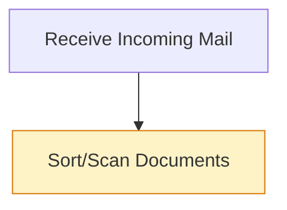

# Story 6.2: Seed Script — Completed Interviews & Synthesis

Status: done

## Story

As a demo presenter,
I want two completed interviews and a synthesis result pre-seeded with realistic data,
So that the supervisor view has content to display from the start.

## Acceptance Criteria

1. **Given** project and process tree are seeded (Story 6.1), **When** interview seed data is created, **Then** two completed interviews exist: Rachel Torres (Austin, TX) and Marcus Williams (Kansas City, MO) with status `captured` (MVP16)
2. **And** each interview has 5-8 exchanges following the reflect-and-confirm segment structure with `exchangeType`, `segmentId`, `isVerified` — exactly one `isVerified = true` per segment (MVP16)
3. **And** each interview has a validated individual process schema that passes Zod validation against `individualProcessSchemaSchema` from `src/lib/schema/workflow.ts` (MVP16)
4. **And** each interview has a personal Mermaid.js diagram definition that renders a valid flowchart (MVP16)
5. **And** structured captures (verb-object-purpose decomposition) exist for each interview via `structuredCaptures` table
6. **And** one pending interview token is seeded for Janet Park (Ogden, UT) with status `pending` (MVP17) — token row only, no interview row
7. **And** a synthesis result is seeded from the two completed interviews with three divergence annotations: sort timing, classification method, QC check (MVP18)
8. **And** synthesis checkpoints (Match + Classify stage results) are seeded in `synthesisCheckpoints` table
9. **And** all seeded data passes the same Zod validation as live data — validate with real schemas before inserting
10. **And** synthesis divergence annotations reference correct interviewee data (affectedIntervieweeIds match actual interview IDs)

## Tasks / Subtasks

- [x] Task 1: Create interview token seed data (AC: #1, #6)
  - [x] Seed token for Rachel Torres: `intervieweeName: 'Rachel Torres'`, `intervieweeRole: 'Mail Clerk'`, deterministic token string and UUID from seed-constants
  - [x] Seed token for Marcus Williams: `intervieweeName: 'Marcus Williams'`, `intervieweeRole: 'Document Processor'`, deterministic token and UUID
  - [x] Seed token for Janet Park: `intervieweeName: 'Janet Park'`, `intervieweeRole: 'Mail Clerk'`, deterministic token and UUID — this is the pending demo token
  - [x] All tokens reference the project ID and L2 leaf process node ID from Story 6.1 constants

- [x] Task 2: Create interview records for Rachel and Marcus (AC: #1)
  - [x] Rachel's interview: `status: 'captured'`, `llmProvider: 'anthropic'`, `sttProvider: 'web-speech'`, `startedAt` and `completedAt` set to past dates
  - [x] Marcus's interview: same pattern, different timestamps
  - [x] Janet does NOT get an interview row — only a token (status remains pending at the token level)

- [x] Task 3: Create exchange history for each interview (AC: #2)
  - [x] Each interview needs 6-8 exchanges following the reflect-and-confirm segment pattern
  - [x] Segment structure per segment: `question` (agent) → `response` (interviewee) → `reflective_summary` (agent, `isVerified: false`) → `confirmation` (interviewee, `isVerified: false`) — then mark the reflective_summary as `isVerified: true`
  - [x] Each exchange needs: `segmentId` (UUID, same for all exchanges in a segment), `exchangeType`, `speaker`, `content`, `isVerified`, `sequenceNumber` (auto-incrementing across the interview)
  - [x] Content should be realistic IRS mail processing workflow: receiving mail, sorting, scanning, classifying with SCRS, data entry, QC checks, routing
  - [x] Rachel's narrative: emphasizes sorting BEFORE scanning, uses manual classification fallback, has batch-level QC
  - [x] Marcus's narrative: scans BEFORE sorting (divergence #1), relies on SCRS automated classification (divergence #2), does item-level QC (divergence #3)
  - [x] Exactly one `isVerified = true` per segment — only on the `reflective_summary` exchange

- [x] Task 4: Create individual process schemas (AC: #3, #9)
  - [x] Build Rachel's schema as `IndividualProcessSchema` JSON matching `individualProcessSchemaSchema` from `src/lib/schema/workflow.ts`
  - [x] Build Marcus's schema similarly but reflecting his different workflow order
  - [x] Each schema has: `schemaVersion: '1.0'`, `processNodeId`, `interviewId`, `steps[]` (5-7 steps with `id`, `label`, `type`, `sourceType: 'interview_discovered'`, `sourceExchangeIds`), `connections[]`, `metadata` with `extractionMethod: 'programmatic'`
  - [x] Steps use verb phrases: "Receive Incoming Mail", "Sort Mail by Type", "Scan Documents", "Classify with SCRS", "Enter Data", "Perform QC Check", "Route to Processing"
  - [x] **Validate both schemas against `individualProcessSchemaSchema.parse()` before inserting** — fail the seed if validation fails
  - [x] Store in `individualProcessSchemas` table: `schemaJson` (the validated JSON), `validationStatus: 'valid'`, `extractionMethod: 'programmatic'`

- [x] Task 5: Create Mermaid diagram definitions (AC: #4)
  - [x] Rachel's diagram: simple vertical flowchart with rounded rectangles for steps, diamond for decision points, top-to-bottom flow
  - [x] Marcus's diagram: same pattern but reflecting his step ordering (scan before sort)
  - [x] Store in `individualProcessSchemas.mermaidDefinition` field
  - [x] Use `graph TD` format with labeled nodes and connections

- [x] Task 6: Create structured captures (AC: #5)
  - [x] One `structuredCaptures` row per interview
  - [x] `captureJson` contains verb-object-purpose decomposition: `{ captures: [{ verb, object, purpose, actor?, systemName? }] }`
  - [x] Captures should align with the process schema steps

- [x] Task 7: Create synthesis result with divergences (AC: #7, #10)
  - [x] Build `workflowJson` as a `SynthesisOutput` object matching `synthesisOutputSchema` from `src/lib/schema/synthesis.ts`
  - [x] Include `normalizedWorkflow` (array of `MatchResult` objects), `divergenceAnnotations` (3 annotations), `matchMetadata`, `narrativeSummary`, `interviewCount: 2`, `sourceInterviewIds`
  - [x] Three divergence annotations:
    1. **Sort timing**: `divergenceType: 'sequence_conflict'` — Rachel sorts before scanning, Marcus scans before sorting
    2. **Classification method**: `divergenceType: 'genuinely_unique'` — Rachel uses manual fallback, Marcus relies on SCRS automation
    3. **QC check**: `divergenceType: 'uncertain_needs_review'` — Rachel does batch QC, Marcus does item-level QC
  - [x] Each annotation needs: `id` (uuid), `stepId` (references a synthesis step), `divergenceType`, `intervieweeIds` (array of interview IDs), `confidence` (0-1), `explanation`, `sourceType: 'synthesis_inferred'`
  - [x] **Validate against `synthesisOutputSchema.parse()` before inserting**
  - [x] Store in `synthesisResults`: `synthesisVersion: 1`, `interviewCount: 2`, `workflowJson`, `mermaidDefinition` (synthesis Mermaid diagram)

- [x] Task 8: Create synthesis Mermaid diagram (AC: #7)
  - [x] Synthesis diagram shows the normalized workflow with CSS classes on divergence nodes
  - [x] Use classes: `divergence-sequence`, `divergence-unique`, `divergence-uncertain` (from Story 5.3 patterns)
  - [x] Store in `synthesisResults.mermaidDefinition`

- [x] Task 9: Create synthesis checkpoints (AC: #8)
  - [x] Seed Match checkpoint (Stage 3): `stage: 'match'`, `resultJson` contains match results array, `durationMs: ~200`
  - [x] Seed Classify checkpoint (Stage 4): `stage: 'classify'`, `resultJson` contains classification result with divergences, `durationMs: ~150`
  - [x] Both reference same `synthesisVersion: 1`

- [x] Task 10: Add to seed.ts and test (AC: #9)
  - [x] Add interview/synthesis seeding after the foundational data in `seed.ts`
  - [x] Run Zod validation on all JSON payloads before DB insert
  - [x] Run full seed script and verify all data appears correctly
  - [x] Verify idempotency — running twice doesn't create duplicates

## Dev Notes

### Exchange Structure — Reflect-and-Confirm Pattern

Each segment follows this exact sequence:
1. `question` (speaker: `agent`) — agent asks about a workflow step
2. `response` (speaker: `interviewee`) — worker describes their process
3. `reflective_summary` (speaker: `agent`, `isVerified: true`) — agent reformulates the response
4. `confirmation` (speaker: `interviewee`, `isVerified: false`) — worker confirms

Key rules:
- `segmentId` is the same UUID for all 4 exchanges in a segment
- `sequenceNumber` increments across the entire interview (1, 2, 3, 4, 5, 6, ...)
- Only `reflective_summary` or `revised_summary` can have `isVerified: true`
- Exactly ONE verified exchange per segment
- Unique constraint exists on `(interviewId, sequenceNumber)`

### Zod Schema Shapes

**IndividualProcessSchema** (`src/lib/schema/workflow.ts`):
```typescript
{
  schemaVersion: string,
  processNodeId: uuid,
  interviewId: uuid,
  steps: [{ id: uuid, label: string, type: 'step'|'decision', sourceType: 'interview_discovered', sourceExchangeIds: string[] }],
  connections: [{ from: uuid, to: uuid, label?: string }],
  metadata: { extractionMethod: 'programmatic'|'llm_fallback', extractedAt: ISO datetime, stepCount: number, decisionPointCount: number }
}
```

**DivergenceAnnotation** (`src/lib/schema/synthesis.ts`):
```typescript
{
  id: uuid,
  stepId: uuid,
  divergenceType: 'genuinely_unique' | 'sequence_conflict' | 'uncertain_needs_review',
  intervieweeIds: string[] (min 1),
  confidence: number (0-1),
  explanation: string,
  sourceType: 'synthesis_inferred'  // literal
}
```

**SynthesisOutput** (`src/lib/schema/synthesis.ts`):
```typescript
{
  normalizedWorkflow: MatchResult[],
  divergenceAnnotations: DivergenceAnnotation[],
  matchMetadata: MatchResult[],
  narrativeSummary: string,
  interviewCount: number (min 2),
  sourceInterviewIds: string[]
}
```

**MatchResult** (`src/lib/schema/workflow.ts`):
```typescript
{
  matchType: 'exact_match' | 'semantic_match' | 'subsumption' | 'split_merge' | 'unmatched',
  confidence: number (0-1),
  rationale: string,
  sourceSteps: [{ interviewId, intervieweeName, stepId, stepLabel }] (min 1),
  sourceType: 'synthesis_inferred'  // literal
}
```

### Three Divergences — Content Details

1. **Sort timing** (`sequence_conflict`, confidence: 0.85): Rachel sorts incoming mail by document type BEFORE scanning. Marcus scans all documents FIRST, then sorts digitally. Same outcome, different ordering.

2. **Classification method** (`genuinely_unique`, confidence: 0.90): Rachel describes manually classifying documents when SCRS fails, using a reference binder. Marcus says SCRS handles everything automatically and he never manually classifies.

3. **QC check** (`uncertain_needs_review`, confidence: 0.65): Rachel does QC at the batch level — checking a sample from each batch. Marcus does item-level QC — checking every document. Unclear if this is a real difference or terminology.

### Mermaid Diagram Format

Individual diagrams use this format:


Synthesis diagram adds CSS classes for divergences:


### Existing Query Functions Available

From `src/lib/db/queries.ts`:
- `createInterview(data)` — already exists
- `createInterviewExchange(data)` — check if exists, add if not
- `createSynthesisResult(data)` — already exists (takes explicit synthesisVersion)
- `createSynthesisCheckpoint(data)` — already exists
- Story 6.1 adds: `createProject`, `createProcessNode`, `createInterviewToken`, etc.

May need to add:
- `createIndividualProcessSchema(data)` — insert into `individualProcessSchemas`
- `createStructuredCapture(data)` — insert into `structuredCaptures`

### IRS Federal Document Processing Domain Context

The "Receive and Digitize Incoming Mail" process at an IRS Service Center involves:
- Receiving physical mail at the loading dock
- Sorting by form type (1040, 1099, W-2, correspondence)
- Scanning/digitizing documents
- SCRS (Submission Classification and Routing System) auto-classifies
- Data entry of key fields
- Quality control checks
- Routing to downstream processing units

### Project Structure Notes

- Seed data lives in `src/lib/db/seed.ts` (extends Story 6.1)
- Constants in `src/lib/db/seed-constants.ts` (from Story 6.1)
- No new directories needed
- Schema validation imports from `src/lib/schema/workflow.ts` and `src/lib/schema/synthesis.ts`

### References

- [Source: _bmad-output/planning-artifacts/epics.md#Epic 6, Story 6.2]
- [Source: src/lib/schema/workflow.ts — IndividualProcessSchema, MatchResult schemas]
- [Source: src/lib/schema/synthesis.ts — DivergenceAnnotation, SynthesisOutput schemas]
- [Source: src/lib/db/schema.ts — all table definitions, enums, constraints]
- [Source: src/lib/db/queries.ts — existing create functions]
- [Source: skills/federal-document-processing/skill.md — domain context for realistic content]
- [Source: _bmad-output/implementation-artifacts/5-3-*.md — Mermaid divergence CSS classes]

## Dev Agent Record

### Agent Model Used
Claude Opus 4.6 (1M context)

### Debug Log References
N/A

### Completion Notes List
- Created `seed-data.ts` with all interview content, schemas, Mermaid diagrams, captures, and synthesis data
- Rachel Torres: 6 segments × 4 exchanges = 24 exchanges, sort→scan→classify(manual fallback)→data entry→batch QC
- Marcus Williams: 6 segments × 4 exchanges = 24 exchanges, scan→sort(digital)→classify(SCRS only)→data entry→item QC
- Individual schemas validated against `individualProcessSchemaSchema.parse()` before insertion
- Synthesis output validated against `synthesisOutputSchema.parse()` before insertion
- 3 divergence annotations: sort timing (sequence_conflict), classification method (genuinely_unique), QC check (uncertain_needs_review)
- Synthesis Mermaid diagram uses CSS classes: `divergence-sequence`, `divergence-unique`, `divergence-uncertain`
- Match and classify checkpoints seeded with realistic durations (215ms, 148ms)
- Janet Park token seeded as pending (only token, no interview row)
- All 648 tests pass, zero type errors

### File List
- `src/lib/db/seed-data.ts` (new)
- `src/lib/db/seed.ts` (modified — added interview/synthesis seeding)
- `src/lib/db/seed-constants.ts` (modified — already had all IDs from Story 6.1)
